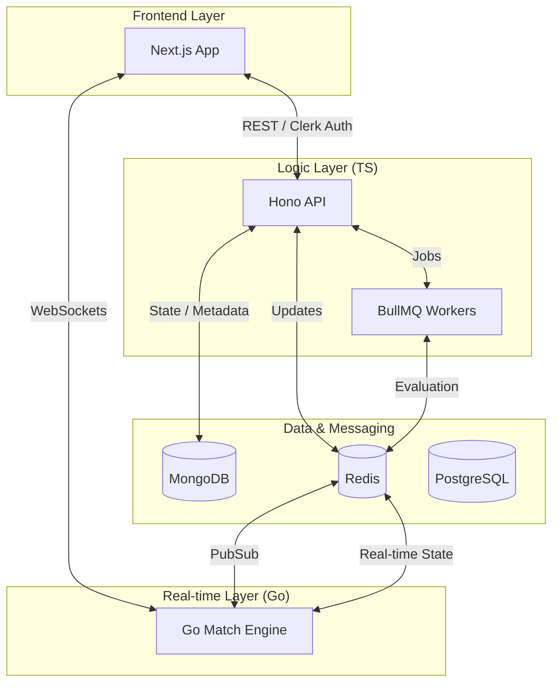

# 🏗️ Coding Arena: System Architecture

Welcome to the **Coding Arena** architectural blueprint. This document defines the high-level system design, service boundaries, and data flow of the platform.

## 🗺️ High-Level System Map

The platform is built as a **Distributed Multi-Service Architecture**, leveraging the strengths of **TypeScript (Hono/Bun)** for the API and **Go (Gin/Hub)** for the real-time match engine.

---

## 🏛️ Layered Design Philosophy

### 1. Primary API (`/api`)
Built with **Hono** running on **Bun**, this layer follows a strict **Domain-Driven Design (DDD)** pattern.
- **Controllers**: Thin entry points that delegate to the service layer.
- **Services**: The "Brain" containing business rules and repository orchestration.
- **Repositories**: Atomic data access layer for MongoDB and PostgreSQL.
- **Dependency Injection**: Fully decoupled via **Awilix**, ensuring testability and modularity.

### 2. Match Engine (`/arena`)
A high-concurrency **Go** service designed for sub-millisecond real-time state management.
- **WebSocket Hub**: Manages thousands of concurrent socket connections using Goroutines and Channels.
- **State Sync**: Uses **Redis Pub/Sub** to listen for event triggers from the TypeScript API (e.g., Match Start).
- **Concurrency**: Leverages Go's `RWMutex` and non-blocking channels for thread-safe state mutations.

---

## 🛡️ Core Responsibilities

| Service | Primary Responsibility | Side Effects |
| :--- | :--- | :--- |
| **Hono API** | Auth, CRUD, Problem Management | Triggers BullMQ jobs, publishes to Redis. |
| **Go Arena** | Real-time Room Sync, Leaderboards | Broadcasts to WebSocket clients. |
| **Workers** | Code Execution, Evaluator AI | Updates Match Result in DB/Redis. |
| **Redis** | Shared State, Job Queue, Pub/Sub | Cross-service coordination. |

---

## 🏁 Concurrency Strategy
To handle **200+ concurrent users**, we implement:
- **Atomic Operations**: Using Redis Lua scripts to prevent "Race Conditions" during match join/exit.
- **Distributed Locking**: Ensuring that only one worker evaluates a single submission at a time.
- **Vertical Scoping**: The Go Hub is vertically scaled to handle raw socket traffic, while the API is horizontally scalable.

> [!TIP]
> Each match is isolated in its own **Redis Hash**, allowing for rapid state updates without locking the entire database.

---
*Status: Architecture Hardened & Verified* 🛡️🏗️✨🚀📊📈🔥🎨🍿🏆🏁🏙️🌆
