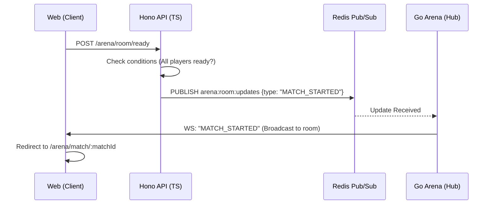
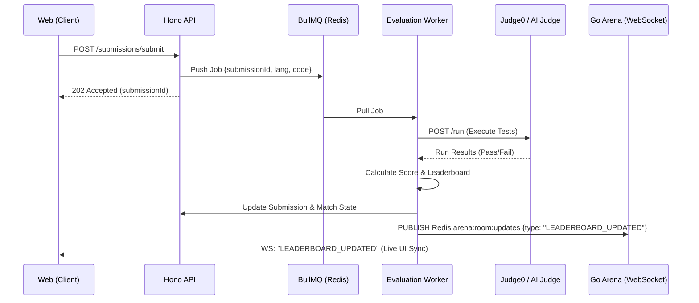

# 🌊 Coding Arena: Data & System Flows

This document maps the critical "Dynamic Paths" in the **Coding Arena** system, from match joining to AI-powered code evaluation.

---

## ⚡ Match Lifecycle & Synchronization

How the **Next.js Frontend**, **Hono API**, and **Go Arena** work together to synchronize a live match.



---

## 🧪 Submission & Evaluation Pipeline

The high-depth journey of a coding submission through the async workers and the AI evaluator.



---

## 🔑 Authentication & Social Sync

How we maintain a consistent user profile across the system.

```mermaid
graph LR
    subgraph "External"
        Clerk[Clerk Auth]
    end

    subgraph "Internal"
        API[Hono API]
        DB[(MongoDB)]
    end

    Clerk -->> User: Login
    User -->> API: Webhook (clerk-user-created)
    API -->> DB: upsertUser(metadata)
    API -->> API: Enrich Profile
```

---

## 🏁 Real-time Concurrency Logic

### Problem: Multiple users clicking "Start Match" at the same time.
### Solution: Distributed Locking & Atomic State.
1.  **Hono API** attempts to set a Redis lock for the `matchId`.
2.  The first request wins, the second is rejected with `409 Conflict`.
3.  The winner updates the `matchStatus` and broadcasts the update via the **Go Hub**.

---
*Status: System Flows Fully Mapped* 🛡️🏗️✨🚀📊📈🔥🎨🍿🏆🏁🏙️🌆
