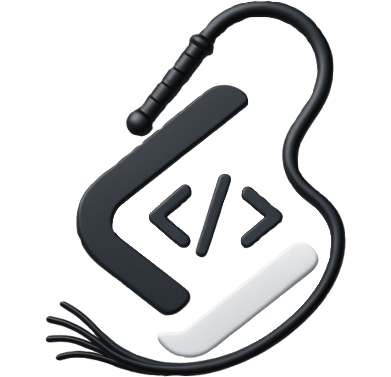

<h1 align="center">
  
  <b>SlaveCode</b>
</h1>

  <b>The Ultimate Platform for Software Engineers</b> 
  <i>Your code is your master. Serve it well.</i>

Master algorithms, system design, and interview prep. Join the ultimate all-in-one coding academy and real-time arena to prove your engineering excellence.

Master your skills with a comprehensive platform designed for growth. Access over **11,000+ coding problems**, explore our **Academy** supporting **80 languages**, and follow structured **DSA roadmaps**. Prepare for interviews with **460+ company-specific questions**, dive into **System Design** with detailed concepts and a fully-featured AI-Powered Workspace, and more.

---

## 🛠️ Technology Stack

*   **Frontend UI**: Next.js 15+ (App Router), React, TailwindCSS, Zustand, Monaco Editor, Tldraw Infinite Whiteboard
*   **REST API Gateway**: Hono (running on Bun), Awilix for Dependency Injection (DI)
*   **Multiplayer Match Engine**: Golang (Fiber WebSockets, Channels, and native Go routines)
*   **Background Queues**: BullMQ (Node/Bun workers)
*   **Relational Database**: PostgreSQL (Neon serverless PostgreSQL, mapped via Drizzle ORM)
*   **Document Database**: MongoDB (Atlas Cloud, mapped via Mongoose for problems, test cases, and logs)
*   **Memory Store & Pub/Sub**: Redis / Valkey (Aiven hosted, powers queues, Go session locks, and worker communications)
*   **Authentication**: Clerk Identity Management (OAuth, Edge Route cryptographic JWT checks)
*   **Sandboxed Code Execution**: Judge0 (Dockerized sandbox) & Wandbox API (Alternative remote compilation)
*   **AI Gateway Routing**: Google Gemini,Gpt,Deepseek, Groq Cloud and more (centralized proxy gateway routing, using One API Gateway)

---

## 💻 Platform Features

SlaveCode is more than just a code submission site — it is a complete competitive programmer's ecosystem. Here is every feature available from the platform navigation, in order:

---

### 🎓 Academy — [slavecode.codes/academy/tracks](https://slavecode.codes/academy/tracks)
Master programming languages through structured, exercise-driven learning tracks. The Academy hosts **82+ language tracks** spanning everything from beginner-friendly Gleam, Go, and Haskell to advanced functional and compiled languages. Each track is tagged by paradigm (Compiled, Functional, Declarative, Imperative, etc.) and contains hundreds of progressive exercises. Every language has a properly structured track roadmap with detailed concepts and exercises — from "Hello World" to advanced algorithm implementations.

---

### 🗺️ Roadmap — [slavecode.codes/roadmap](https://slavecode.codes/roadmap)
Stop guessing what to learn next. The interactive DSA Roadmap guides you through every concept of Data Structures and Algorithms in a highly structured, logical sequence. Navigate through clearly defined subtopics from basic Arrays to complex Trees and Tries, with each topic paired with targeted practice problems. Track your true mastery as you conquer every node on the path — from basics through Booleans, Strings, If-Else Statements, to Numbers and beyond.

---

### 💻 Problems — [slavecode.codes/problems](https://slavecode.codes/problems)
A curated bank of algorithmic and language-specific problems ranging from introductory exercises to advanced competitive programming challenges. Each problem is paired with hidden test cases evaluated by Judge0 sandboxes, with automatic AI judging fallbacks for edge cases. Track your solutions, language performance, and solution votes. Problems are filterable by difficulty, category, company, and programming language.

---

### 🏗️ System Design — [slavecode.codes/systemdesign](https://slavecode.codes/systemdesign)
Master system design through structured, in-depth learning tracks covering **56 essential topics** designed for deliberate practice. Topics span core infrastructure concepts including: Databases, Load Balancers, Caches, CDNs, Microservices, Message Queues, API Gateways, and Blob Storage. Each topic is paired with an interactive whiteboard workspace (powered by Tldraw) where you can sketch architecture diagrams, generate visual system maps from code, and chat with an AI assistant to deepen your understanding.

---

### 🏢 Companies — [slavecode.codes/companies](https://slavecode.codes/companies)
Explore **460+ top tech company profiles** including Google, Meta, Amazon, Apple, Microsoft, Oracle, Netflix, Uber, Airbnb, Adobe, TCS, Infosys, and many more. Each company profile surfaces real interview questions that you can solve directly in the built-in code editor while tracking your solve history and success stats per company over time.

---

### ⚔️ Arena — [slavecode.codes/arena](https://slavecode.codes/arena)
The multiplayer competitive battleground. **Host or join a coding match** in real time — select problems from the extensive catalog to host a custom coding match, or enter a pin code to join an active match. Compete against up to 50 challengers simultaneously with a live leaderboard. Arena Points and global rankings are awarded based on your final rank and execution speed. The real-time match state is powered by a dedicated Golang WebSocket server using Redis Pub/Sub for instant leaderboard broadcasting.

---

### ⚡ Compilers — [slavecode.codes/compilers](https://slavecode.codes/compilers)
A **high-performance multi-language compiler playground** where you can write and execute code scripts instantly in a distraction-free environment. Features include a Monaco code editor with syntax highlighting, a built-in Excalidraw scratchpad for sketching, a countdown timer, theme switching, and real-time output panels. Supports all major programming languages through the Judge0 sandboxed execution engine.

---

### 🏆 Contests — [slavecode.codes/contests](https://slavecode.codes/contests)
A **unified global contest calendar** that aggregates upcoming coding competitions from across the web into a single dashboard. Tracks events from LeetCode Weekly Contests, Codeforces Rounds, AtCoder Beginner Contests, CodeChef Starters, and more — with live countdown timers, contest durations, and direct registration links. Never miss a competition again.

---

## 📁 Repository Directory Structure

The codebase is organized into key folders for modular development:

| Folder | Name | Tech Stack | Role & Responsibility |
| :--- | :--- | :--- | :--- |
| **[`/api`](api)** | The Brain | Bun, Hono, Drizzle, Postgres, Mongo, Redis | **Central REST API**: Coordinates authentication via Clerk, manages problem banks, serves code execution logic, routes AI diagram queries, processes solution submissions, and updates Postgres database stats. |
| **[`/arena`](arena)** | The Heart | Go, Fiber, Redis | **Real-time Engine**: A high-concurrency WebSocket server that manages lobbies, processes real-time leaderboard scores, matches competitive programming battle players, and handles Pub/Sub events. |
| **[`/web`](web)** | The Face | Next.js 15+, Zustand | **Frontend UI**: Responsive React web client hosting the coding interface (Monaco Editor), System Design whiteboard editor (Tldraw), multiplayer dashboard panels, and the Academy portal. |
| **[`/admin`](admin)** | The Operator | Next.js, TailwindCSS | **Admin Dashboard**: Portal interface enabling managers to create contest problems, manage categories taxonomy, audit AI verdicts feedback logs, and moderate user profiles and more. |
| **[`/driver`](driver)** | The Bridge | Java, C++, C, Go, Rust... | **Compiler Adapter**: Wraps student and competitor code into language-specific compiler templates and execution packages before dispatching them safely to the Judge0 sandbox. |
| **[`/cloud`](cloud)** | The Orchestrator | TypeScript | **Cloud Controller**: VM provisioner handling scaling, health inspection, and start/stop automation scripts of remote sandbox servers running on Azure. |
| **[`/infra`](infra)** | The Blueprint | Docker | **Container Infrastructure**: Production-ready docker-compose files, Dockerfiles, and environment config recipes to containerize and deploy microservices. |
| **[`/envexamples`](envexamples)** | The Vault | Config | **Env Templates**: Holds standard environment templates (`.env.example`) to ensure consistent configuration keys and values across the REST API, Frontend, and WebSocket nodes. |
| **[`/docs`](docs)** | The Source | Markdown, PNG | **Technical Documents**: Complete reference manual containing project setup workflows, UML sequence/activity/class/usecase diagrams, database ERDs, and caching key architectures. |
| **[`/testings`](testings)** | The Guard | TS/JS | **Quality Checks**: System integration scripts to verify correct network handshakes, database client pools connection status, and basic endpoint accessibility. |
| **[`/scratch`](scratch)** | The Scratchpad | Markdown | **Developer Sandbox**: Area hosting temporary local mock test cases, draft notes, configuration testing files, and scratch scripts for developer experiments. |
| **[`/scripts`](scripts)** | The Tools | Bash / Node | **Automation Utilities**: Houses bash shell tools and Node modules to automate database seeding, execute Drizzle migrations, and maintain Docker networks. |

---

## 🗺️ Architectural Blueprints & Diagrams

Detailed behavioral, structural, and state-machine guides are located on the root directory. Select a document below to inspect its blueprints:

### 🏗️ Structural & Infrastructure Blueprints
*   **[System Architecture](system_architecture.md)**: Details the communication flows between the Next.js Frontend, Node (Hono) REST API, Go WebSockets, Redis, and databases.
*   **[Deployment Architecture](deployment_diagram.md)**: Maps out Docker configurations, VM deployments across Vercel, GCP, Azure, and managed database clusters (PostgreSQL, MongoDB, Redis).
*   **[Component Wiring](component_diagram.md)**: Explains the internal structure of the Hono Node API (controllers, services, databases, queues).
*   **[Database Schema ERD](database_erd.md)**: Full Entity-Relationship diagram showing Drizzle SQL schemas and Mongoose collection structures.
*   **[Class Diagram](class_diagram.md)**: Deep OOP mapping of services, models, repositories, and helper methods.

### ⚡ Behavioral & State Flow Documentation
*   **[Redis Queue & Pub/Sub Architecture](redis_architecture.md)**: Maps out Redis keys, Lua script locks, and worker communications.
*   **[Sequence Flow Diagram](sequence_diagram.md)**: Illustrates the asynchronous BullMQ compilation pipelines and WebSocket sync events.
*   **[Activity & Fallback Logic](activity_diagram.md)**: Charts the logic for execution fallbacks, AI judging overrides, and academy locking schedules.
*   **[State Machine Lifecycles](state_machine_diagram.md)**: Maps match status (`WAITING` -> `FINISHED`) and submission status transitions.
*   **[Platform Access Use Cases](use_case_diagram.md)**: Profiles permissions for guest visitors and authenticated coders.

---

## 📖 Subsystem Developer Documentation

Deep-dive architectural guides and specs for specific subcomponents:

### 📡 REST API Services
*   **[Submissions Engine Guide](docs/api/submissions/index.md)**: Details submissions, evaluators, and results caching.
*   **[Problems Bank Spec](docs/api/problems/index.md)**: Documents problem definitions, taxonomy parsing, and test assets.
*   **[Multiplayer WebSocket Rooms API](docs/api/arena/index.md)**: Manages lobby creation and match status updates.
*   **[AI Copilot & Diagram Chat](docs/api/system-design/index.md)**: Explains One API Gateway LLM routing.
*   **[Academy Learning & Tracks](docs/api/academy/index.md)**: Covers curriculum and locking mechanics.
*   **[Background Jobs & Workers](docs/api/workers/index.md)**: Explains BullMQ queues for submissions, contest sync, and cleanup.
*   **[User Accounts & Statistics](docs/api/user/index.md)**: Manages identity metadata and stats aggregation.

### 🎮 Golang Arena Server
*   **[WebSocket Match Hub](docs/arena/hub.md)**: Covers connection handlers and room concurrency.
*   **[Match State Handlers](docs/arena/handlers.md)**: Manages scoring metrics, submission ticks, and player state updates.
*   **[Go Infrastructure Packages](docs/arena/pkg.md)**: Explains Redis Lua script bindings and database connectors.

### 🎨 Frontend UI App
*   **[Page Route Index](docs/frontend/pages.md)**: Details the Next.js page layout hierarchy.
*   **[Workspace State Hook](docs/frontend/hooks/workspace.md)**: Focuses on editor panels and compiler sync.
*   **[System Design Canvas Hook](docs/frontend/hooks/system-design.md)**: Handles whiteboard and diagram code sync.
*   **[Multiplayer Match Hooks](docs/frontend/hooks/arena.md)**: Syncs leaderboards and room sockets.

### 💾 Database Schema Specs
*   **[PostgreSQL Tables Schema](docs/database-schema/users.md)**: Relational schema for users, stats, follows, and solved histories.
*   **[MongoDB Problems Schema](docs/database-schema/mongo_problem.md)**: Detailed document structure for test cases and problem payloads.
*   **[MongoDB Submissions Schema](docs/database-schema/mongo_submission.md)**: Mappings for submission metrics and AI verdict logs.
*   **[MongoDB Arena Matches Schema](docs/database-schema/mongo_arena_match.md)**: Structures for multiplayer scores and histories.

---

## ⚙️ Project Setup & Installation

All local and Docker configuration steps, environment credentials, port maps, and automated health checks are fully detailed in the core **[Setup & Verification Guide (setup.md)](setup.md)**.
