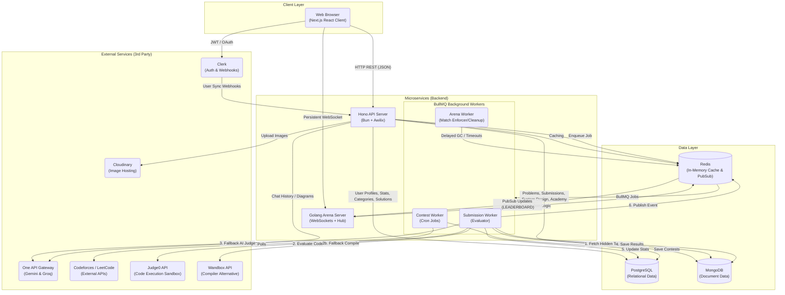

# 🚀 SlaveCode: High-Performance Competitive Programming & System Design Platform

SlaveCode is a comprehensive, modern platform built for real-time multiplayer competitive programming matches, structured computer science curricula, and interactive system design workspaces. 

The architecture features a hybrid microservices layout, combining a high-performance **Golang WebSocket match engine** with a lightweight **Hono REST API** (running on Bun), asynchronous **BullMQ background workers**, and a sandboxed **Judge0 code execution engine** with automatic **LLM-based AI judging fallbacks**.

---

## 🏗️ System Architecture & Data Flow

Below is the high-level infrastructure map illustrating the physical network relationships between the Client Layer, Microservices, Data Stores, and Sandbox Execution engines.

---

## 🛠️ Technology Stack Matrix

*   **Frontend UI**: Next.js 15+ (App Router), React, TailwindCSS, Zustand, Monaco Editor, Tldraw Infinite Whiteboard
*   **REST API Gateway**: Hono (running on Bun), Awilix for Dependency Injection (DI)
*   **Multiplayer Match Engine**: Golang (Fiber WebSockets, Channels, and native Go routines)
*   **Background Queues**: BullMQ (Node/Bun workers)
*   **Relational Database**: PostgreSQL (Neon serverless PostgreSQL, mapped via Drizzle ORM)
*   **Document Database**: MongoDB (Atlas Cloud, mapped via Mongoose for problems, test cases, and logs)
*   **Memory Store & Pub/Sub**: Redis / Valkey (Aiven hosted, powers queues, Go session locks, and worker communications)
*   **Authentication**: Clerk Identity Management (OAuth, Edge Route cryptographic JWT checks)
*   **Sandboxed Code Execution**: Judge0 (Dockerized sandbox) & Wandbox API (Alternative remote compilation)
*   **AI Gateway Routing**: Google Gemini & Groq Cloud (centralized proxy gateway routing, AI audits, and diagram prompts)

---

## 📁 Repository Directory Structure

The codebase is organized into key folders for modular development:

| Path | Description | Key Tech Stack |
| :--- | :--- | :--- |
| **[`/api`](api)** | Central REST API, DI containers, services, repository layers, and BullMQ worker processors. | Bun, Hono, Drizzle ORM, Mongoose, BullMQ |
| **[`/arena`](arena)** | Real-time WebSocket matchmaking server, handling lobby connections, match state, and scoring. | Golang, Fiber WebSockets, Redis |
| **[`/web`](web)** | Interactive web client dashboard, code panels, academy tracking, and system design whiteboards. | Next.js 15+, Zustand, Monaco, Tldraw |
| **[`/admin`](admin)** | Admin portal interface for managing problems, system design topics, metrics audit logs, and user status. | Next.js, TailwindCSS |
| **[`/driver`](driver)** | The execution driver. Wraps user code submissions inside language templates before sending to Judge0. | Java, Python, C++, Go, Rust templates |
| **[`/cloud`](cloud)** | VM Orchestrator. Coordinates sandbox server virtual machines on cloud providers (e.g. Azure). | TypeScript |
| **[`/infra`](infra)** | Deployment Docker configurations and worker setup recipes. | Docker |
| **[`/envexamples`](envexamples)** | Master configuration templates for backend, frontend, and real-time servers. | `.env` templates |
| **[`/docs`](docs)** | Developer documentation guides, system UML diagrams, and database collections schemas. | Markdown |
| **[`/testings`](testings)** | Automated connectivity health-checks and QA suites. | TypeScript, Bun |
| **[`/scratch`](scratch)** | Developer workspace for temporary scratch files, experiments, and notes. | Markdown |
| **[`/scripts`](scripts)** | DevOps scripts for local db migration, seeding, and docker maintenance utilities. | Bash / Node |

---

## 🗺️ Architectural Blueprints & Diagrams

Detailed behavioral, structural, and state-machine guides are located on the root directory. Select a document below to inspect its blueprints:

### 🏗️ Structural & Infrastructure Blueprints
*   **[System Architecture](system_architecture.md)**: Details the communication flows between the Next.js Frontend, Node (Hono) REST API, Go WebSockets, Redis, and databases.
*   **[Deployment Architecture](deployment_diagram.md)**: Maps out Docker configurations, VM deployments across Vercel, GCP, Azure, and managed database clusters (PostgreSQL, MongoDB, Redis).
*   **[Component Wiring](component_diagram.md)**: Explains the internal structure of the Hono Node API (controllers, services, databases, queues).
*   **[Database Schema ERD](database_erd.md)**: Full Entity-Relationship diagram showing Drizzle SQL schemas and Mongoose collection structures.
*   **[Class Diagram](class_diagram.md)**: Deep OOP mapping of services, models, repositories, and helper methods.

### ⚡ Behavioral & State Flow Documentation
*   **[Redis Queue & Pub/Sub Architecture](redis_architecture.md)**: Maps out Redis keys, Lua script locks, and worker communications.
*   **[Sequence Flow Diagram](sequence_diagram.md)**: Illustrates the asynchronous BullMQ compilation pipelines and WebSocket sync events.
*   **[Activity & Fallback Logic](activity_diagram.md)**: Charts the logic for execution fallbacks, AI judging overrides, and academy locking schedules.
*   **[State Machine Lifecycles](state_machine_diagram.md)**: Maps match status (`WAITING` -> `FINISHED`) and submission status transitions.
*   **[Platform Access Use Cases](use_case_diagram.md)**: Profiles permissions for guest visitors and authenticated coders.

---

## 📖 Subsystem Developer Documentation

Deep-dive architectural guides and specs for specific subcomponents:

### 📡 REST API Services
*   **[Submissions Engine Guide](docs/api/submissions/index.md)**: Details submissions, evaluators, and results caching.
*   **[Problems Bank Spec](docs/api/problems/index.md)**: Documents problem definitions, taxonomy parsing, and test assets.
*   **[Multiplayer WebSocket Rooms API](docs/api/arena/index.md)**: Manages lobby creation and match status updates.
*   **[AI Copilot & Diagram Chat](docs/api/system-design/index.md)**: Explains One API Gateway LLM routing.
*   **[Academy Learning & Tracks](docs/api/academy/index.md)**: Covers curriculum and locking mechanics.
*   **[Background Jobs & Workers](docs/api/workers/index.md)**: Explains BullMQ queues for submissions, contest sync, and cleanup.
*   **[User Accounts & Statistics](docs/api/user/index.md)**: Manages identity metadata and stats aggregation.

### 🎮 Golang Arena Server
*   **[WebSocket Match Hub](docs/arena/hub.md)**: Covers connection handlers and room concurrency.
*   **[Match State Handlers](docs/arena/handlers.md)**: Manages scoring metrics, submission ticks, and player state updates.
*   **[Go Infrastructure Packages](docs/arena/pkg.md)**: Explains Redis Lua script bindings and database connectors.

### 🎨 Frontend UI App
*   **[Page Route Index](docs/frontend/pages.md)**: Details the Next.js page layout hierarchy.
*   **[Workspace State Hook](docs/frontend/hooks/workspace.md)**: Focuses on editor panels and compiler sync.
*   **[System Design Canvas Hook](docs/frontend/hooks/system-design.md)**: Handles whiteboard and diagram code sync.
*   **[Multiplayer Match Hooks](docs/frontend/hooks/arena.md)**: Syncs leaderboards and room sockets.

### 💾 Database Schema Specs
*   **[PostgreSQL Tables Schema](docs/database-schema/users.md)**: Relational schema for users, stats, follows, and solved histories.
*   **[MongoDB Problems Schema](docs/database-schema/mongo_problem.md)**: Detailed document structure for test cases and problem payloads.
*   **[MongoDB Submissions Schema](docs/database-schema/mongo_submission.md)**: Mappings for submission metrics and AI verdict logs.
*   **[MongoDB Arena Matches Schema](docs/database-schema/mongo_arena_match.md)**: Structures for multiplayer scores and histories.

---

## ⚙️ Project Setup & Installation

All local and Docker configuration steps, environment credentials, port maps, and automated health checks are fully detailed in the core **[Setup & Verification Guide (setup.md)](setup.md)**.
