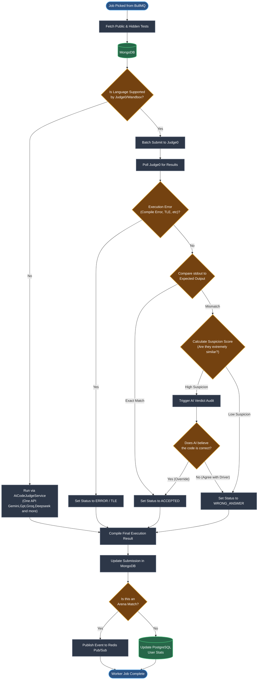
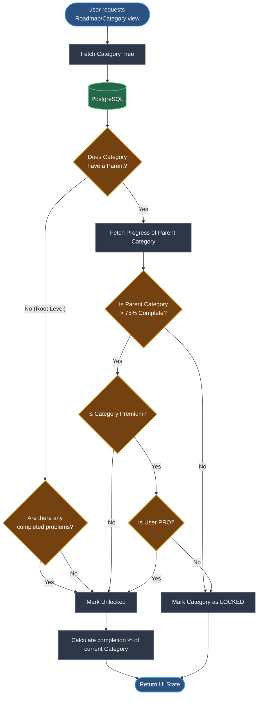

# Activity Diagrams

This document contains **Activity Diagrams** (Flowcharts) that map out the branching logic (`if/else` decisions), loops, and parallel processes inside the SlaveCode backend. 

Activity diagrams are particularly useful for understanding the exact decision trees of background workers.

---

## 1. Submission Evaluation & AI Audit Flow

This flowchart diagrams the intricate decision-making process inside `ExecutionService` and `DriverJudgeExecutionService`. It highlights the fallback mechanisms and the "AI Audit" feature, which uses an LLM to double-check strict test case failures.

---

## 2. Taxonomy & Curriculum Unlocking Flow

This diagram shows the branching logic for a user navigating the Curriculum/Taxonomy tree. It demonstrates how the system checks prerequisites and determines if a problem or category is locked or unlocked.

