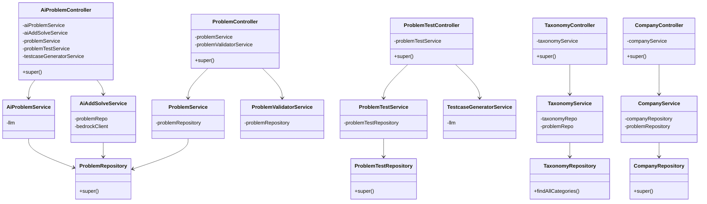
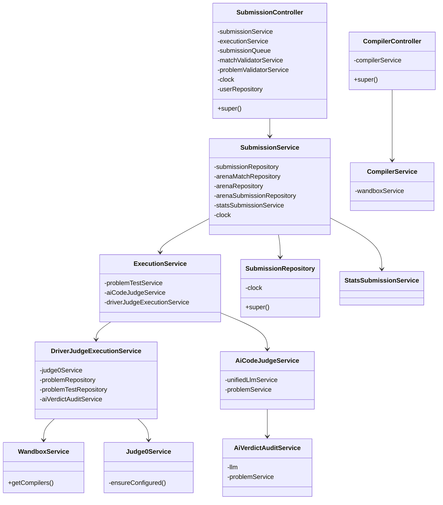
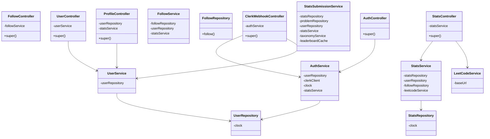
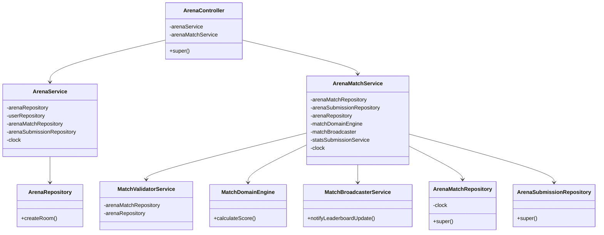
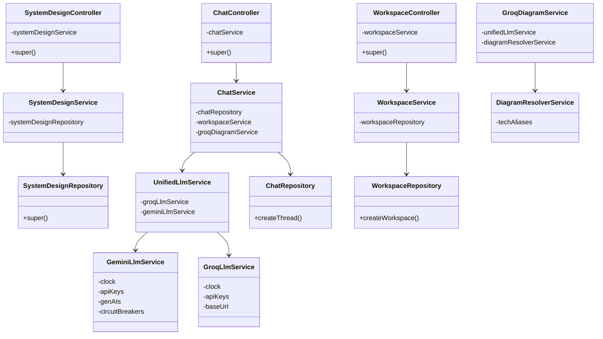
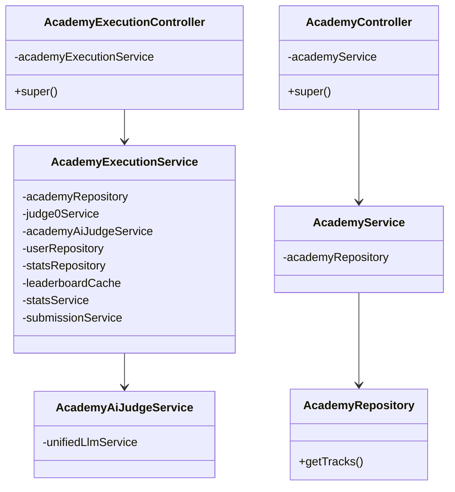
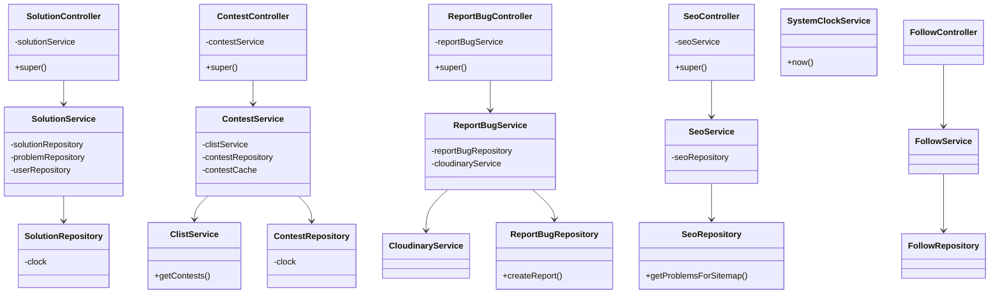

# Comprehensive Class Diagrams (In-Depth)

Because the SlaveCode backend contains over 70 interconnected classes, rendering a single diagram would be unreadable. 

Instead, this document provides an **in-depth Object-Oriented analysis**, broken down by the major domain boundaries of the Hono API. Every class listed here matches the exact implementation in the `api/src/` codebase, including their private dependencies and public methods.

---

## Problem, Taxonomy & AI Generation Domain

---

## Submission & Execution Domain

---

## Users, Stats, Auth & Leaderboard Domain

---

## Arena Multiplayer Domain

---

## System Design & AI Chat Domain

---

## Academy & Learning Domain

---

## Solutions, Social & Misc Domain

---

