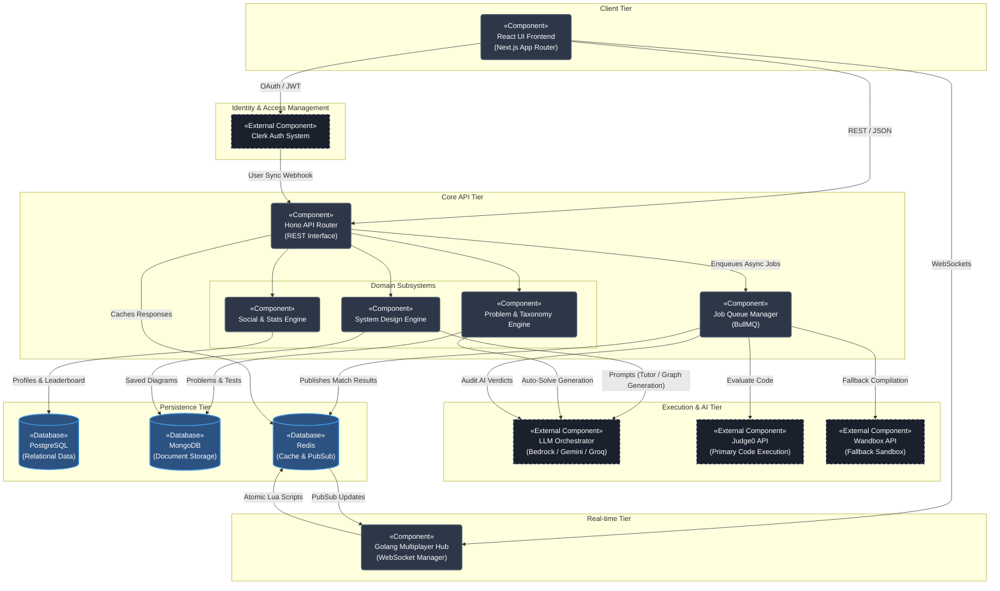

# Component Diagram

This document illustrates the high-level Component Architecture of the SlaveCode platform. A Component Diagram shows how large, distinct software modules interact with each other through defined interfaces or APIs.

Unlike a Class Diagram (which focuses on internal code structure), this diagram treats entire subsystems as black boxes and focuses on the "wiring" between them.

---

## Component Breakdown

1. **React UI Frontend**: The monolithic client-side application. It acts as the primary consumer of all other components.
2. **Clerk Auth System**: An external Identity Provider (IdP). It issues JWTs to the Client and pushes user lifecycle events (creation, deletion) to the Backend via webhooks.
3. **Hono API Router**: The main entry point for all stateless REST requests. It routes traffic to specific Domain Subsystems.
4. **Domain Subsystems**:
   - **Problem & Taxonomy Engine**: Manages reading/writing curriculum data.
   - **Social & Stats Engine**: Calculates ELO, leaderboards, streaks, and user relationships.
   - **System Design Engine**: Manages Excalidraw JSON schemas and interacts with AI for layout resolution.
5. **Job Queue Manager (BullMQ)**: A critical component that decouples slow tasks (code compilation) from the fast API response cycle.
6. **Execution APIs (Judge0 & Wandbox)**: External sandboxed environments that securely compile and run untrusted user code against hidden test cases.
7. **LLM Orchestrator**: The abstraction layer over Amazon Bedrock, Gemini, and Groq used for AI-judging, chat tutoring, and diagram generation.
8. **Golang Multiplayer Hub**: A standalone, highly-concurrent engine dedicated solely to managing live WebSocket traffic for the Arena mode.
9. **Databases**: Postgres (structured social data), Mongo (large JSON documents/test cases), and Redis (pub/sub state and caching).
