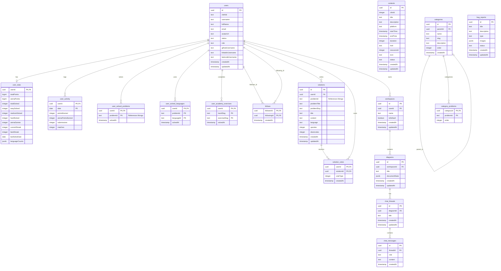
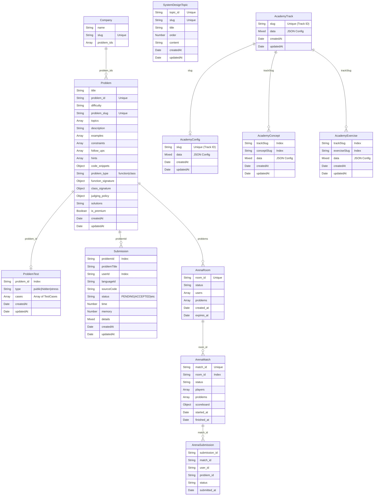

# Database Entity-Relationship Diagrams (ERD)

This document provides a highly accurate ERD generated directly from the deep analysis of the codebase schemas. It is split into our two primary databases: PostgreSQL (Relational) and MongoDB (Document).

## PostgreSQL (Drizzle ORM)

The Postgres database acts as the single source of truth for users, social connections, stats, leaderboards, and structured hierarchy.

## MongoDB (Mongoose)

MongoDB handles unstructured, heavy, or heavily nested data. Since MongoDB is schema-less by nature, this diagram represents the Mongoose application-level schema validations.

