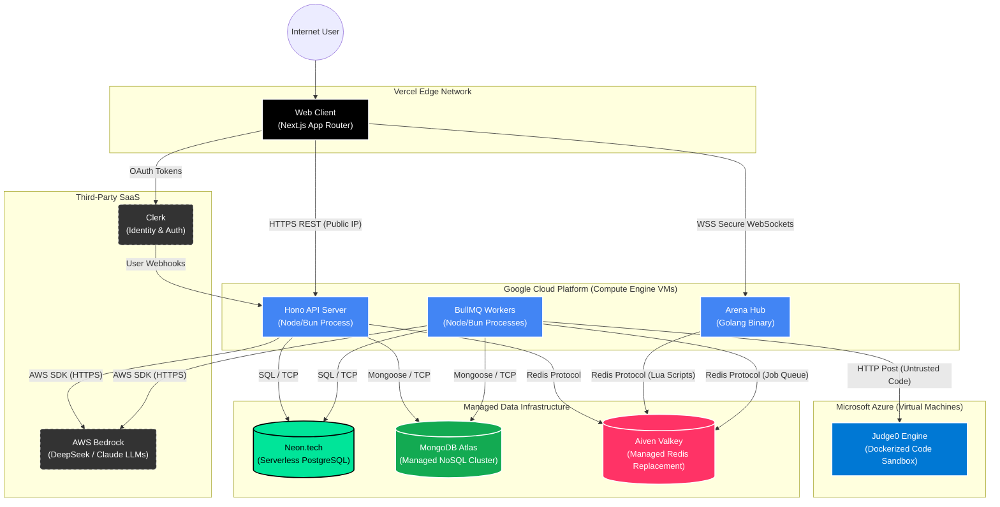

# Deployment Architecture

This document provides a **UML Deployment Diagram** illustrating the physical and logical hardware infrastructure that runs the SlaveCode ecosystem. It maps out exactly where each Docker container, backend service, and database lives across various cloud providers (Vercel, GCP, Azure, and managed DBaaS platforms).

---

## Infrastructure Breakdown

### 1. Vercel (Frontend Hosting)
The Next.js React application is deployed to **Vercel's Edge Network**. Vercel automatically distributes the static assets globally across CDNs and executes any Server-Side Rendered (SSR) pages via Serverless Functions.

### 2. Google Cloud Platform (Primary Backend)
The core backend logic runs on **GCP Virtual Machines (Compute Engine)**. 
- **Hono API**: Handles all standard REST traffic and routing.
- **Go Arena**: Handles thousands of simultaneous persistent WebSocket connections for multiplayer matches. GCP is chosen here to provide raw compute and network throughput without Serverless timeout restrictions.
- **BullMQ Workers**: Background processes sitting on GCP that pull heavy jobs off the Redis queue.

### 3. Microsoft Azure (Execution Sandbox)
The **Judge0 Code Execution Engine** runs in isolated Docker containers on **Azure VMs**. Keeping the execution sandbox physically separated on an entirely different cloud provider (Azure) from the primary databases and API (GCP) drastically reduces the security "blast radius" if a malicious user manages to escape the Docker sandbox using a zero-day exploit.

### 4. Managed Database Providers (DBaaS)
Rather than hosting databases manually on VMs, the data layer uses specialized managed services:
- **Neon.tech**: Provides a highly-scalable, serverless PostgreSQL instance for relational data (Users, Stats, Follows).
- **MongoDB Atlas**: A fully managed cloud NoSQL database for heavy document storage (Problems, Hidden Tests, Execution Logs).
- **Aiven Valkey**: Valkey (an open-source fork of Redis) hosted by Aiven. It powers the extremely high-throughput Pub/Sub messaging required between the GCP BullMQ Workers and the Go Arena WebSocket server, as well as the API cache.

### 5. Third-Party SaaS
- **Clerk**: Handles all user authentication and identity verification at the edge.
- **AWS Bedrock**: The managed AI service hosted by Amazon Web Services, providing API access to DeepSeek and Claude LLMs without needing to provision expensive GPU clusters.
