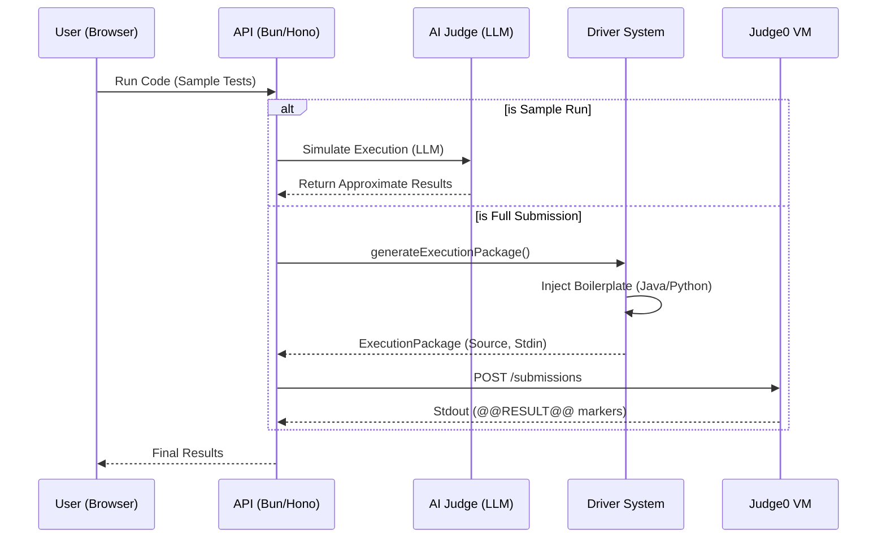

# System Architecture & Flow (Refined)

This document provides a detailed breakdown of the SlaveCode architecture, including the Hybrid Judging system and the real-time Arena Match engine.

## 🏢 Core Modules

### 1. Hybrid Judging System
SlaveCode uses a two-tier judging strategy:
*   **Judge0 (Sandbox)**: The "Gold Standard." Used for final submissions and competitive matches. It provides exact, sandboxed execution.
*   **AI Approximate Judge (Groq/Gemini)**: Used for rapid "run sample" feedback. It uses LLMs to simulate code execution based on the problem description and user code.

### 2. Arena Match Engine (`ArenaService`)
A sophisticated real-time coordination engine that manages:
*   **Redis-based Rooms**: Low-latency room state and player synchronization.
*   **Distributed Locking**: Prevents race conditions during match starts using `withLock`.
*   **Reconciliation (Sync-on-Read)**: Automatically heals state mismatches between Redis and MongoDB.
*   **Match Broadcaster**: Publishes events via Go-based Hubs to connected players.

### 3. Driver System (Strategy Pattern)
The bridge between the API and Judge0. It handles boilerplate injection and type mapping (e.g., converting JSON input to Java `ListNode`).

## 🔄 The Submission Lifecycle

## 📂 Key Service Mapping

| Service | Responsibility |
| :--- | :--- |
| `ArenaService` | Room management, Match timers, Redis sync. |
| `AiCodeJudgeService` | LLM-based code simulation and verdict mapping. |
| `ProblemService` | CRUD operations for problem bank and topics. |
| `GeminiLlmService` | Core LLM orchestration and structured JSON generation. |
| `JavaProvider` | Java-specific driver logic (Zero-Dependency). |
