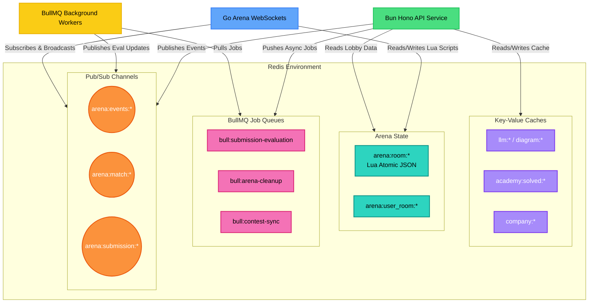

# Redis Architecture & Data Flow

Redis serves as the central nervous system for Coding Arena. It acts as an ultra-fast cache, a state store for real-time multiplayer arenas, an event bus (Pub/Sub) for microservices, and a highly resilient job queue manager for background workers.

## Redis Key Structure & Usage

| Key Pattern / Prefix | Data Type | Owner Service | TTL / Expiry | Purpose |
| :--- | :--- | :--- | :--- | :--- |
| `arena:room:{roomId}` | JSON String | Arena (Go) & API | 24 Hours | Stores the entire JSON state of a multiplayer room (players, host, settings, match state). Updates are handled via Atomic Lua scripts in Go to prevent race conditions during concurrent updates. |
| `arena:user_room:{userId}` | String | Arena (Go) | 24 Hours | O(1) lookup to find which room a user is currently in. Automatically prevents users from joining multiple rooms at the same time. |
| `academy:solved:{userId}:*` | String | API (Hono) | Cleared on solve | Caches which academy tracks a user has solved to significantly speed up profile and track loading times. |
| `company:*` | JSON String | API (Hono) | 24 Hours | Caches aggregated company problems and tags to relieve database pressure. |
| `bull:submission-evaluation:*`| List / Hash | API Workers | Removed on complete | BullMQ queue for processing code executions. Configured with a Smart Backoff Strategy to handle Azure VM cold starts. |
| `bull:arena-cleanup:*` | List / Hash | API Workers | Removed on complete | BullMQ queue for sweeping dead/abandoned rooms asynchronously. |
| `bull:contest-sync:*` | List / Hash | API Workers | Removed on complete | BullMQ queue for periodically scraping Clist.by programming contests. |
| `llm:*`, `diagram:*` | JSON String | API (Hono) | 24h - 7 Days | Caches LLM AI responses and system diagram generations to dramatically reduce API costs and latency. |

 

> [!TIP]
> **Lua Scripting in Arena**
> The Go Arena service uses embedded Lua scripts to update the `arena:room:*` keys. This guarantees atomicity. For example, when two users submit code at the exact same millisecond, Lua ensures both leaderboard scores are updated correctly without overwriting each other.

---

## Pub/Sub Channels (Cross-Service Communication)

The API service uses Redis Pub/Sub to trigger real-time events that the Arena Go service instantly broadcasts to users via WebSockets.

| Channel Pattern | Publisher | Subscriber | Purpose |
| :--- | :--- | :--- | :--- |
| `arena:events:{roomId}` | API (Hono) | Arena (Go) | General room updates (e.g., player joined, player left, host updated settings). |
| `arena:match:started:{roomId}`| API (Hono) | Arena (Go) | Signals to all players that the match has officially begun and the countdown should start. |
| `arena:submission:{roomId}` | API (Hono) | Arena (Go) | Broadcasts a player's real-time progress (e.g., passing 3/5 test cases) to update the live multiplayer leaderboard. |

 

> [!NOTE]
> **Microservice Decoupling**
> By using Redis Pub/Sub, the Bun (Hono) API never has to know the IPs or locations of the Go WebSocket servers. It just shouts into Redis, and Go instantly forwards the message to the correct users.

---

## Architecture Diagram

