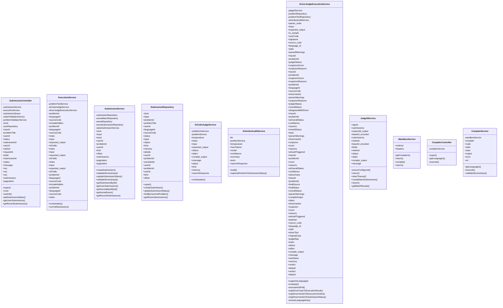
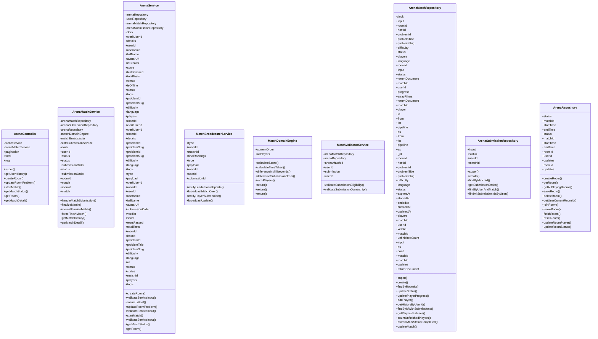
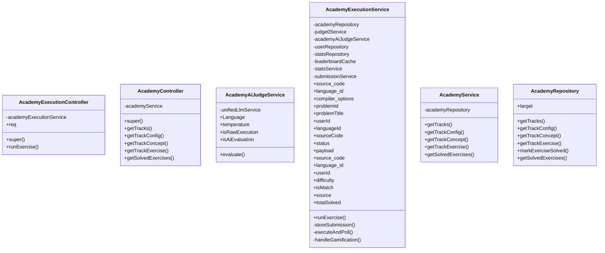

# Comprehensive Class Diagrams (Detailed)

## Problem, Taxonomy & AI Generation Domain

```mermaid
classDiagram
    class AiProblemController {
        -aiProblemService
        -aiAddSolveService
        -problemService
        -problemTestService
        -testcaseGeneratorService
        +c
        +problem
        +c
        +c
        +super()
        +import()
        +generateAiSolution()
        +generateTestcases()
    }
    class ProblemTestController {
        -problemTestService
        +c
        +super()
        +upsertTests()
        +getTestsForProblem()
        +getTestsForProblemAndType()
    }
    class ProblemController {
        -problemService
        -problemValidatorService
        +req
        +req
        +totalItems
        +itemCount
        +perPage
        +totalPages
        +currentPage
        +req
        +super()
        +createProblem()
        +getProblemBySlug()
        +getProblemById()
        +getProblemsByTopic()
        +getProblems()
        +getUserSolvedProblems()
    }
    class AiAddSolveService {
        -problemRepo
        -bedrockClient
        +region
        +is_signature_inaccurate
        +fixed_judging_policy
        +comparator_mode
        +multi_answer
        +output_order
        +solutions
        +language
        +approach_name
        +editorial_explanation
        +language
        +approach_name
        +editorial_explanation
        +IMPORTANT
        +problemId
        +prompt
        +modelId
        +max_completion_tokens
        +temperature
        +messages
        +role
        +content
        +type
        +text
        +modelId
        +contentType
        +accept
        +processSingleProblem()
        -buildPrompt()
        -extractAndParseJSON()
        -invokeModelOnBedrock()
    }
    class AiProblemService {
        -llm
        +input
        +title
        +problem_id
        +difficulty
        +problem_slug
        +topics
        +description
        +examples
        +constraints
        +follow_ups
        +hints
        +code_snippets
        +problem_type
        +is_premium
        +problem
        +rawLlmResponse
        +solution
        +solutions
        +type
        +properties
        +problem
        +type
        +properties
        +problem_type
        +hints
        +function_signature
        +type
        +properties
        +name
        +return_type
        +params
        +type
        +items
        +type
        +properties
        +name
        +type
        +inplace_param_index
        +class_signature
        +type
        +properties
        +class_name
        +constructor_params
        +type
        +items
        +type
        +properties
        +methods
        +type
        +items
        +type
        +properties
        +name
        +return_type
        +params
        +type
        +items
        +type
        +properties
        +judging_policy
        +type
        +properties
        +comparator_mode
        +multi_answer
        +validation_policy
        +output_order
        +audit_hints
        +temperature
        +solutions
        +title
        +description
        +problem_slug
        +difficulty
        +problem_id
        +topics
        +examples
        +constraints
        +follow_ups
        +code_snippets
        +judging_policy
        +comparator_mode
        +multi_answer
        +validation_policy
        +output_order
        +audit_hints
        +problem
        +rawLlmResponse
        +rewriteAndGenerate()
    }
    class ProblemTestService {
        -problemTestRepository
        +problem_id
        +type
        +getTestsForProblem()
        +getTestsForProblemAndType()
        +upsertTests()
    }
    class ProblemValidatorService {
        -problemRepository
        +validateProblemExists()
        +validateProblemBySlug()
    }
    class ProblemService {
        -problemRepository
        +page
        +limit
        +getProblemBySlug()
        +getProblemById()
        +searchByTopic()
        +getAllProblems()
        +upsertProblem()
        +getUserSolvedProblems()
    }
    class TestcaseGeneratorService {
        -llm
        +title
        +description
        +constraints
        +examples
        +function_signature
        +model
        +temperature
        +maxTokens
        +input
        +expected_output
        +weight
        +is_sample
        +input
        +expected_output
        +weight
        +is_sample
        +Count
        +hiddenCount
        +rawLlmResponse
        +generateTestcases()
    }
    class ProblemTestRepository {
        +problem_id
        +type
        +cases
        +returnDocument
        +upsert
        +super()
        +findByProblemAndType()
        +findAllByProblem()
        +upsertTests()
    }
    class ProblemRepository {
        +page
        +limit
        +topics
        +examples
        +constraints
        +follow_ups
        +hints
        +code_snippets
        +returnDocument
        +upsert
        +super()
        +findByProblemId()
        +findManyByProblemIds()
        +findBySlug()
        +searchByTopic()
        +findPaginated()
        +createOrUpdate()
        +getUserSolvedProblems()
        +eq()
    }
    class TaxonomyController {
        -taxonomyService
        +super()
        +getTree()
        +getUserProgress()
        +getCategoryDetail()
        +getCategoryDetailById()
        +createCategory()
        +mapProblem()
        +unmapProblem()
        +batchMapProblems()
    }
    class TaxonomyService {
        -taxonomyRepo
        -problemRepo
        +children
        +parent
        +parent
        +categoryId
        +problemId
        +order
        +categoryId
        +problemId
        +order
        +getTaxonomyTree()
        +getUserRoadmapProgress()
        +getCategoryDetail()
        +getCategoryDetailById()
        +createCategory()
        +mapProblemToCategory()
        +batchMapProblemsToCategory()
        +invalidateUserProgress()
        +unmapProblemFromCategory()
    }
    class TaxonomyRepository {
        +target
        +set
        +target
        +set
        +categoryId
        +problemId
        +findAllCategories()
        +findCategoryBySlug()
        +findCategoryById()
        +findChildren()
        +getProblemMappings()
        +createCategory()
        +mapProblem()
        +batchMapProblems()
        +unmapProblem()
        +and()
        +eq()
        +eq()
        +getProblemCount()
        +getProblemCountRecursive()
        +getAllProblemCounts()
        +getUserRoadmapProgress()
        +eq()
        +getSolvedProblemIds()
        +and()
        +eq()
        +inArray()
    }
    class CompanyController {
        -companyService
        +super()
        +getCompanies()
        +getCompanyProblems()
        +createCompany()
    }
    class CompanyService {
        -companyRepository
        -problemRepository
        +company
        +getCompanies()
        +getCompanyProblems()
        +createCompany()
    }
    class CompanyRepository {
        +super()
        +getCompanies()
        +getCompanyBySlug()
        +createOrUpdate()
    }

```

---

## Submission & Execution Domain

---

## Users, Stats, Auth & Leaderboard Domain

```mermaid
classDiagram
    class FollowController {
        -followService
        +super()
        +follow()
        +unfollow()
        +getFollowers()
        +getFollowing()
    }
    class ProfileController {
        -userRepository
        -statsService
        +message
        +user
        +githubUsername
        +linkedinUsername
        +leetcodeUsername
        +super()
        +updateProfile()
    }
    class UserController {
        -userService
        +id
        +username
        +fullName
        +avatarUrl
        +super()
        +searchUsers()
    }
    class FollowService {
        -followRepository
        -userRepository
        -statsService
        +followerClerkId
        +followingUsername
        +followerClerkId
        +targetUsername
        +currentClerkId
        +targetUsername
        +followUser()
        +unfollowUser()
        +getFollowers()
        +getFollowing()
        +getFollowStatus()
    }
    class UserService {
        -userRepository
        +searchUsers()
    }
    class FollowRepository {
        +userId
        +id
        +username
        +fullName
        +avatarUrl
        +id
        +username
        +fullName
        +avatarUrl
        +follow()
        +unfollow()
        +and()
        +eq()
        +eq()
        +isFollowing()
        +and()
        +eq()
        +eq()
        +getFollowCounts()
        +getFollowersList()
        +getFollowingList()
    }
    class UserRepository {
        -clock
        +findByClerkId()
        +findById()
        +findByUsername()
        +findByEmail()
        +search()
        +or()
        +ilike()
        +ilike()
        +findAll()
        +create()
        +update()
        +deleteByClerkId()
    }
    class StatsController {
        -statsService
        +message
        +super()
        +getProfileStats()
        +getLeaderboard()
        +syncLeaderboard()
        +searchLeaderboard()
    }
    class LeetCodeService {
        -baseUrl
        +solved
        +total
        +easy
        +medium
        +hard
        +contest
        +globalRank
        +totalParticipants
        +topPercentile
        +attended
        +getUserStats()
        +fetch()
        +fetch()
    }
    class StatsSubmissionService {
        -statsRepository
        -problemRepository
        -userRepository
        -statsService
        -taxonomyService
        -leaderboardCache
        +submissionId
        +userId
        +status
        +submissionId
        +inputUserId
        +submission
        +user
        +userId
        +isMatch
        +totalSolved
        +userId
        +problemId
        +languageId
        +rankedPlayers
        +userId
        +points
        +arenaPoints
        +isMatch
        +totalSolved
        +handleSubmissionUpdate()
        -processAcceptedSolve()
        +handleArenaMatchFinalization()
    }
    class StatsService {
        -statsRepository
        -userRepository
        -followRepository
        -leetcodeService
        +user
        +id
        +clerkId
        +username
        +fullName
        +avatarUrl
        +githubUsername
        +linkedinUsername
        +leetcodeUsername
        +joinedAt
        +stats
        +totalPoints
        +arenaPoints
        +totalSolved
        +easySolved
        +mediumSolved
        +hardSolved
        +arenaGames
        +currentStreak
        +bestStreak
        +rank
        +activityLog
        +social
        +leetcode
        +userId
        +username
        +fullName
        +avatarUrl
        +points
        +rank
        +totalSolved
        +limit
        +offset
        +syncLeaderboard()
        +invalidateProfile()
        +getProfileStats()
        +searchLeaderboard()
        -getFollowContext()
        +getLeaderboard()
    }
    class StatsRepository {
        -clock
        +totalPoints
        +arenaPoints
        +totalSolved
        +easySolved
        +mediumSolved
        +hardSolved
        +arenaGames
        +target
        +set
        +totalPoints
        +arenaPoints
        +totalSolved
        +easySolved
        +mediumSolved
        +hardSolved
        +arenaGames
        +currentStreak
        +bestStreak
        +lastSolveDate
        +target
        +set
        +currentStreak
        +bestStreak
        +lastSolveDate
        +date
        +pointsEarned
        +arenaPointsEarned
        +submissions
        +matches
        +target
        +set
        +pointsEarned
        +arenaPointsEarned
        +submissions
        +matches
        +updateUserStats()
        +updateLanguageCount()
        +COALESCE()
        +updateStreak()
        +GREATEST()
        +logActivity()
        +getTopUsers()
        +getUserStats()
        +getUserActivityLog()
        +recordSolvedProblem()
        +recordSolvedLanguage()
    }
    class AuthController {
        +id
        +clerkId
        +username
        +email
        +avatarUrl
        +status
        +role
        +super()
        +me()
    }
    class ClerkWebhookController {
        -authService
        +clerkId
        +originalClerkUsername
        +username
        +email
        +avatarUrl
        +received
        +type
        +super()
        +handle()
    }
    class AuthService {
        -userRepository
        -clerkClient
        -clock
        -statsService
        +email
        +fullName
        +avatarUrl
        +status
        +role
        +username
        +fullName
        +email
        +avatarUrl
        +email
        +fullName
        +avatarUrl
        +status
        +role
        +ensureUser()
        +ensureUserFromIdOnly()
        +syncUser()
        +validateServiceInput()
        +deleteUser()
        -generateUniqueUsername()
        -pushUsernameToClerk()
    }

```

---

## Arena Multiplayer Domain

---

## System Design & AI Chat Domain

```mermaid
classDiagram
    class SystemDesignController {
        -systemDesignService
        +super()
        +getTopics()
        +getTopicContent()
        +createTopic()
    }
    class SystemDesignService {
        -systemDesignRepository
        +getTopics()
        +getTopicContent()
        +createTopic()
    }
    class SystemDesignRepository {
        +super()
        +getTopics()
        +getTopicContent()
        +createTopic()
    }
    class ChatController {
        -chatService
        +super()
        +createThread()
        +getThreads()
        +deleteThread()
        +getMessages()
        +sendMessage()
    }
    class ChatService {
        -chatRepository
        -workspaceService
        -groqDiagramService
        +userId
        +diagramId
        +userId
        +threadId
        +userId
        +input
        +diagramId
        +title
        +userId
        +diagramId
        +userId
        +threadId
        +input
        +diagramId
        +title
        +role
        +content
        +threadId
        +role
        +content
        +threadId
        +role
        +content
        +textResponse
        +canvasActions
        +thread
        -verifyDiagramAccess()
        -verifyThreadAccess()
        +createThread()
        +getThreadsByDiagramId()
        +deleteThread()
        +getMessages()
        +sendMessage()
    }
    class ChatRepository {
        +createThread()
        +findThreadById()
        +findThreadsByDiagramId()
        +deleteThread()
        +touchThread()
        +createMessage()
        +findMessagesByThreadId()
    }
    class WorkspaceController {
        -workspaceService
        +super()
        +createWorkspace()
        +getWorkspaces()
        +getWorkspaceById()
        +updateWorkspace()
        +deleteWorkspace()
        +createDiagram()
        +getDiagrams()
        +getDiagramById()
        +updateDiagram()
        +deleteDiagram()
        +cloneDiagram()
    }
    class WorkspaceService {
        -workspaceRepository
        +name
        +isDefault
        +name
        +isDefault
        +title
        +documentState
        +workspaceId
        +title
        +documentState
        -checkWorkspaceOwnership()
        -checkDiagramOwnership()
        +createWorkspace()
        +getWorkspaces()
        +getWorkspaceById()
        +updateWorkspace()
        +deleteWorkspace()
        +getOrCreateDefaultWorkspace()
        +getWorkspaceRaw()
        +createDiagram()
        +getDiagrams()
        +getDiagramById()
        +updateDiagram()
        +deleteDiagram()
        +cloneDiagram()
    }
    class WorkspaceRepository {
        +createWorkspace()
        +findWorkspaceById()
        +findWorkspacesByUserId()
        +findDefaultWorkspaceByUserId()
        +and()
        +eq()
        +eq()
        +updateWorkspace()
        +deleteWorkspace()
        +createDiagram()
        +findDiagramById()
        +findDiagramsByWorkspaceId()
        +updateDiagram()
        +deleteDiagram()
    }
    class DiagramResolverService {
        -techAliases
        +postgres
        +postgresql
        +mysql
        +mssql
        +sql
        +database
        +db
        +dynamo
        +dynamodb
        +mongo
        +mongodb
        +cassandra
        +redis
        +memcached
        +node
        +nodejs
        +lambda
        +serverless
        +docker
        +k8s
        +kubernetes
        +ec2
        +vm
        +server
        +nginx
        +haproxy
        +envoy
        +proxy
        +loadbalancer
        +lb
        +dns
        +route53
        +apigateway
        +gateway
        +s3
        +storage
        +bucket
        +blob
        +cloudfront
        +cdn
        +kafka
        +rabbitmq
        +queue
        +mq
        +sqs
        +sns
        +react
        +vue
        +angular
        +nextjs
        +html
        +css
        +javascript
        +typescript
        -initializeMaps()
        +resolveIconId()
    }
    class GeminiLlmService {
        -clock
        -apiKeys
        -genAIs
        -circuitBreakers
        +systemPrompt
        +userPrompt
        +modelName
        +opts
        +systemPrompt
        +userPrompt
        +keyIndex
        +model
        +systemInstruction
        +contents
        +generationConfig
        +temperature
        +maxOutputTokens
        +responseMimeType
        +data
        +raw
    }
    class GroqDiagramService {
        -unifiedLlmService
        -diagramResolverService
        +prompt
        +pastMessages
        +temperature
        +textResponse
        +canvasActions
        +textResponse
        +canvasActions
        +textResponse
        +canvasActions
        +textResponse
        +canvasActions
        +textResponse
        +canvasActions
        +generateDiagram()
    }
    class GroqLlmService {
        -clock
        -apiKeys
        -baseUrl
        +systemPrompt
        +userPrompt
        +modelName
        +opts
        +systemPrompt
        +userPrompt
        +keyIndex
        +model
        +messages
        +temperature
        +max_tokens
        +response_format
        +raw
        +method
        +headers
        +authorization
        +data
        +raw
    }
    class UnifiedLlmService {
        -groqLlmService
        -geminiLlmService
    }

```

---

## Academy & Learning Domain

---

## Solutions, Social & Misc Domain

```mermaid
classDiagram
    class SolutionController {
        -solutionService
        +super()
        +createSolution()
        +getSolutionsForProblem()
        +voteForSolution()
        +updateSolution()
        +deleteSolution()
        +getSolutionsByUser()
    }
    class SolutionService {
        -solutionRepository
        -problemRepository
        -userRepository
        -isUUID()
        +createSolution()
        +getSolutionsForProblem()
        +getSolutionById()
        +voteForSolution()
        +updateSolution()
        +deleteSolution()
        +getSolutionsByUser()
    }
    class SolutionRepository {
        -clock
        +solution
        +author
        +username
        +avatarUrl
        +fullName
        +author
        +solution
        +author
        +username
        +avatarUrl
        +fullName
        +author
        +target
        +set
        +voteType
        +type
        +solution
        +author
        +username
        +avatarUrl
        +fullName
        +author
        +create()
        +findById()
        +findByProblemId()
        +upsertVote()
        +getUserVote()
        +and()
        +eq()
        +eq()
        +updateVoteCounts()
        +update()
        +delete()
        +deleteVote()
        +and()
        +eq()
        +eq()
        +findByUserId()
        +countByUserId()
    }
    class ContestController {
        -contestService
        +super()
        +async()
        +async()
        +async()
    }
    class ClistService {
        +getContests()
    }
    class ContestService {
        -clistService
        -contestRepository
        -contestCache
        +clistId
        +title
        +platform
        +icon
        +duration
        +href
        +resourceId
        +status
        +syncExternalContests()
        +getUpcomingContests()
        +getExternalContests()
    }
    class ContestRepository {
        -clock
        +target
        +set
        +title
        +description
        +platform
        +startTime
        +endTime
        +duration
        +href
        +icon
        +status
        +findById()
        +findByClistId()
        +findUpcoming()
        +upsert()
        +deleteOld()
    }
    class ReportBugController {
        -reportBugService
        +title
        +description
        +type
        +super()
    }
    class ReportBugService {
        -reportBugRepository
        -cloudinaryService
        +reportBugRepository
        +cloudinaryService
        +title
        +description
        +type
        +images
        +submitReport()
    }
    class ReportBugRepository {
        +createReport()
    }
    class SeoController {
        -seoService
        +super()
        +getSitemapProblems()
        +getSitemapAcademyTracks()
        +getSitemapAcademyExercises()
        +getSitemapSystemDesignLessons()
        +getSitemapCompanyTags()
        +getSitemapUsers()
    }
    class SeoService {
        -seoRepository
        +getProblemsSitemapData()
        +getAcademyTracksSitemapData()
        +getAcademyExercisesSitemapData()
        +getSystemDesignLessonsSitemapData()
        +getCompanyTagsSitemapData()
        +getUsersSitemapData()
    }
    class SeoRepository {
        +username
        +updatedAt
        +getProblemsForSitemap()
        +getAcademyTracksForSitemap()
        +getAcademyExercisesForSitemap()
        +getSystemDesignLessonsForSitemap()
        +getCompanyTagsForSitemap()
        +getUsersForSitemap()
    }
    class SystemClockService {
        +now()
        +nowDate()
        +nowIso()
    }
    class CloudinaryService {
        +cloud_name
        +api_key
        +api_secret
        +resource_type
        +uploadImage()
        +reject()
        +resolve()
        +deleteImage()
        +reject()
        +resolve()
    }

```

---

