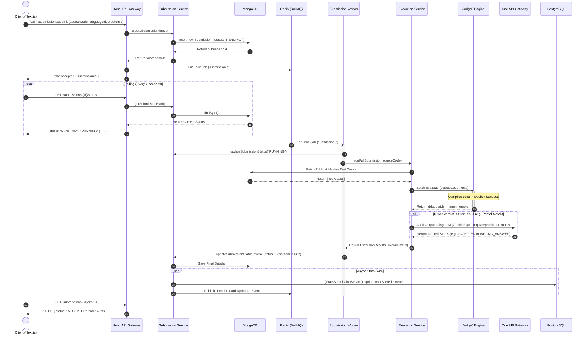
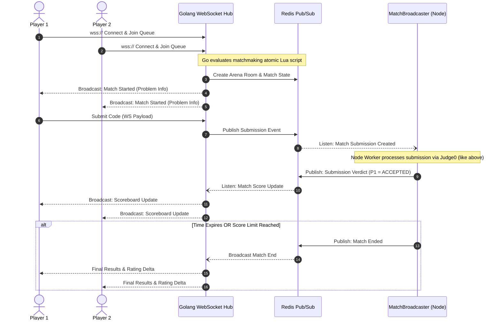

# System Sequence Diagrams

This document outlines the step-by-step dynamic behavior of the most complex workflows in the SlaveCode backend. 

Unlike Structural Diagrams (which show *what* exists), Sequence Diagrams show *how* data moves over time between the Client, API, Background Workers, and External Services.

---

## 1. Asynchronous Code Submission Flow

This sequence diagrams the entire lifecycle of a user clicking "Submit" on a coding problem. Because compiling untrusted code takes time, the API uses an **Asynchronous Job Queue (BullMQ)** pattern.

---

## 2. Arena Multiplayer Real-Time Flow

This sequence diagrams the lifecycle of an Arena match. It relies heavily on WebSockets and Redis PubSub to sync state instantly across multiple players.

