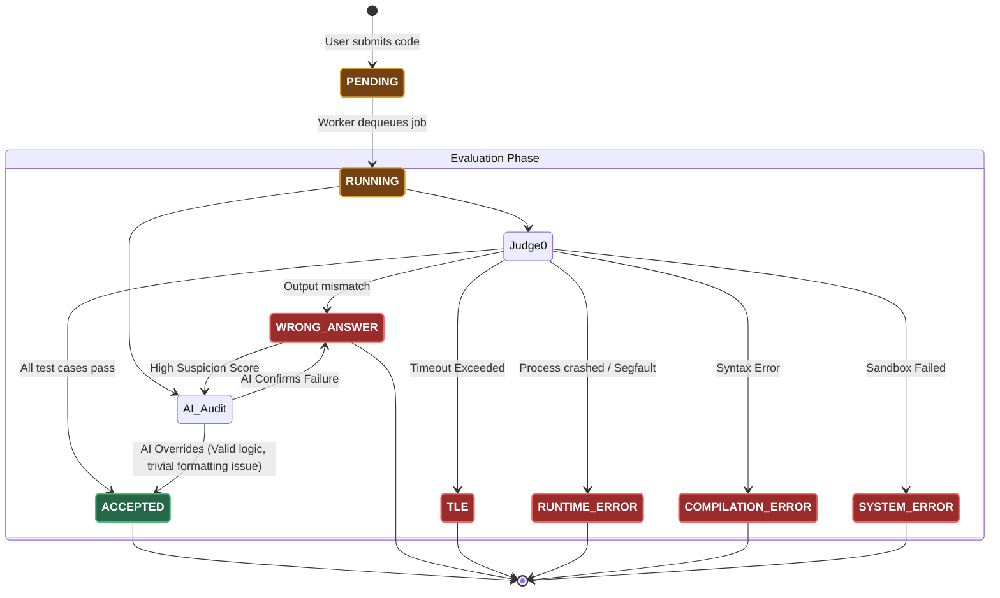
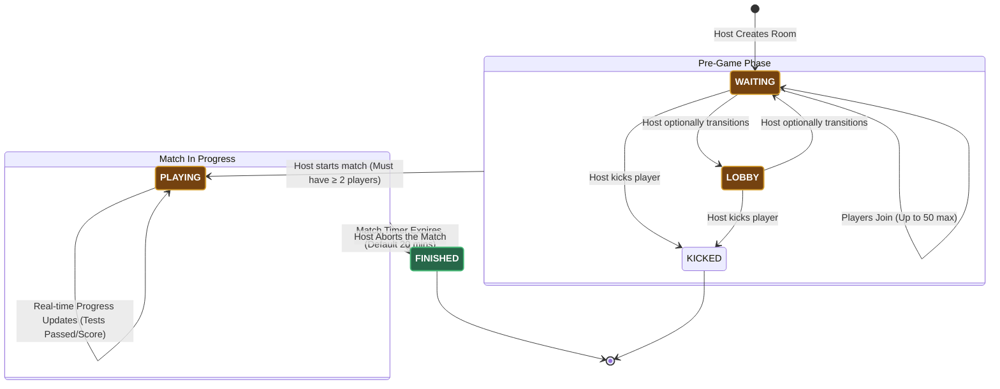

# State Machine Diagrams

This document contains **State Machine Diagrams** that illustrate the lifecycle of key objects in the SlaveCode backend. 

State diagrams show all the possible states an object can be in (like a database record), and the exact events or triggers that cause it to transition from one state to another.

---

## 1. Code Submission Lifecycle

This is the most critical state machine in the system. When a user submits code, it transitions through several stages of asynchronous evaluation before reaching a terminal status.

---

## 2. Arena Multiplayer Match Lifecycle

An Arena match is a real-time state machine managed primarily by the Golang WebSocket Hub and Redis, before being finalized in MongoDB.

