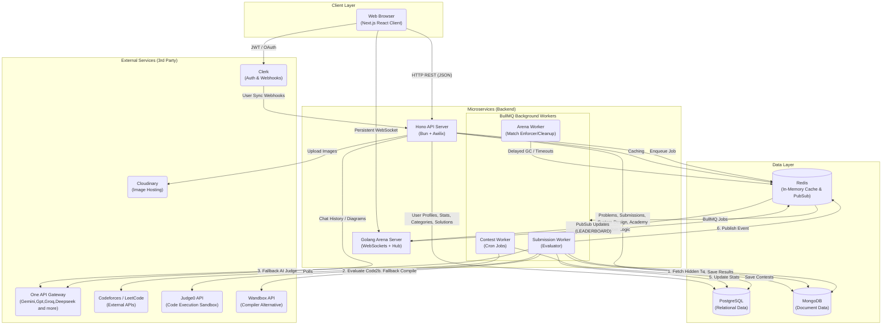

# System Architecture

This document provides a high-level overview of the entire SlaveCode ecosystem. It maps out how the different services, databases, message queues, and external APIs interact with one another.

## Architecture Diagram

Below is a structural Mermaid diagram representing the flow of data through the system. 

---

## Component Explanation

### 1. Client Layer (Next.js)
The frontend is a monolithic Next.js App Router application. It serves the React UI and communicates with the backend via standard REST API calls and persistent WebSockets for multiplayer mode.

### 2. External Services
- **Clerk**: Handles all user authentication. The frontend gets JWT tokens from Clerk, and the Hono API verifies them. Clerk also sends background Webhooks to the API to sync user creations/deletions into our PostgreSQL database.
- **One API Gateway**: The central AI proxy. Used heavily by `AiAddSolveService` (routing to Gemini,Groq,GPT,Deepseek and more) to evaluate text-based code, generate educational solutions, and power the System Design AI Chat assistant.
- **Cloudinary**: Used to store images (like bug report screenshots or user avatars).
- **Codeforces/LeetCode**: APIs scraped by the background Contest worker to populate the global event calendar.
- **Judge0 & Wandbox**: External Remote Code Execution (RCE) sandbox APIs. The workers send untrusted user code to these services securely, and they return the `stdout`, `stderr`, and `compile_output`.

### 3. Microservices (Backend)
- **Hono API Server (Bun)**: The primary gateway. It handles CRUD operations, single-player problem fetching, taxonomy routing, and enqueuing heavy jobs.
- **Golang Arena Server**: A highly concurrent WebSocket server dedicated strictly to the multiplayer "Arena" battles. It uses Goroutines and Channels to handle thousands of real-time players without blocking.
- **BullMQ Background Workers**: These run asynchronously off the Bun event loop:
  - **Submission Worker**: The heaviest pipeline. It takes code, fetches hidden tests, sends it to the Sandboxed Execution Engine, updates Postgres stats, and publishes Pub/Sub events back to the Go server.
  - **Arena Worker**: Handles timeouts and garbage collection of old multiplayer rooms.
  - **Contest Worker**: A 6-hour cron job that syncs external API data.

### 4. Data Layer
- **PostgreSQL**: The source of truth for highly structured, relational data. Stores Users, Follows, Stats, Leaderboards, Taxonomy (Categories), and Solutions.
- **MongoDB**: Used for massive, unstructured, or heavily nested data. Stores the core Problem definitions, megabytes of Hidden Test Cases, every historical Code Submission, and dynamic JSON payloads (Academy Tracks, Excalidraw documents).
- **Redis**: The most critical real-time bus. It acts as:
  1. The message broker for BullMQ.
  2. The high-speed memory store for the Go Arena Server (using Lua scripts for atomic locks).
  3. A Pub/Sub bridge between the Bun Submission Worker and the Golang WebSocket Hub.
  4. A standard cache for expensive API calls.
