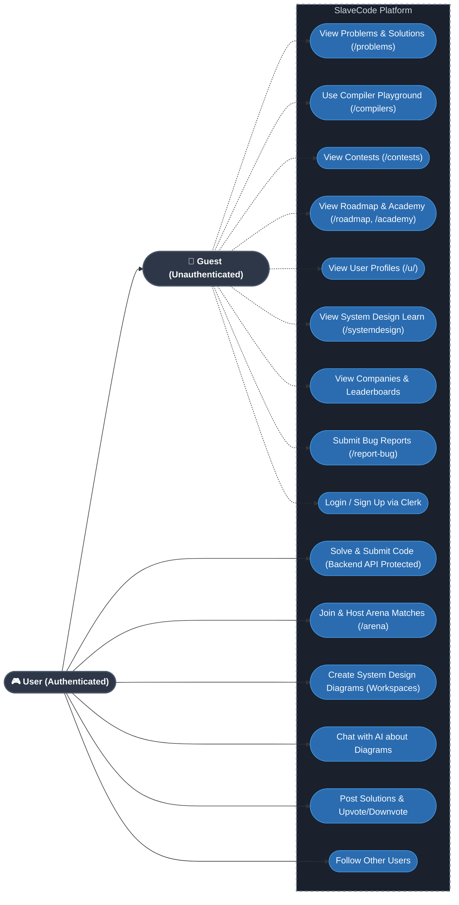

# Use Case Diagram

This document contains the **Use Case Diagram**, which defines exactly what different types of actors (users) can do within the SlaveCode system. 

It maps out the permissions and capabilities of Guests, Registered Players, PRO Players, and Admins.

## Role Permissions
- **Guest (Unauthenticated)**: Has wide read-access across the platform matching `middleware.ts`. Guests can browse Problems, Solutions, Contests, Roadmaps, Academy Tracks, User Profiles, Leaderboards, and even use the generic Compiler Playground and submit Bug Reports.
- **User (Authenticated)**: Inherits all Guest permissions, plus has full read/write access to protected core loops: Submitting problem evaluations to the backend, entering Multiplayer Arena matches, saving System Design diagram workspaces, and utilizing Social features (Following, Posting Solutions).
